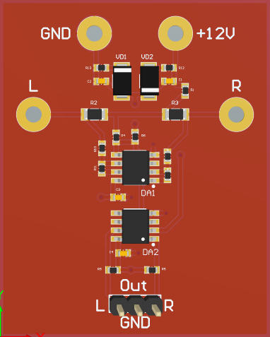
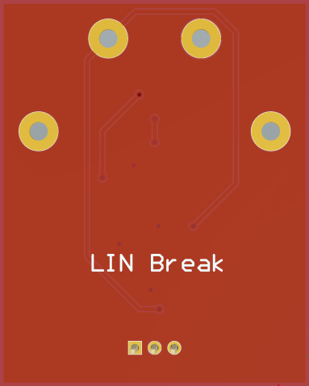

# LIN break

This device allows you to analyze and reverse engineer LIN bus. 
It transmits LIN packets to two different outputs depending from packet source.

## Schematics and PCB Design

All source files are [available on Github](https://github.com/ARNik/LIN_break).
The schematics and PCB layout are in Altium Designer format.

## Licenses

### Circuit Schematics

The circuit schematics of this project are made available under the
[CC-BY-SA](https://creativecommons.org/licenses/by-sa/3.0/) license.

### Hardware Design

 Open source hardware.

### Miscellenious

Data sheets, Altium libraries, 3D Models are subject to vendor specific
licensing.
